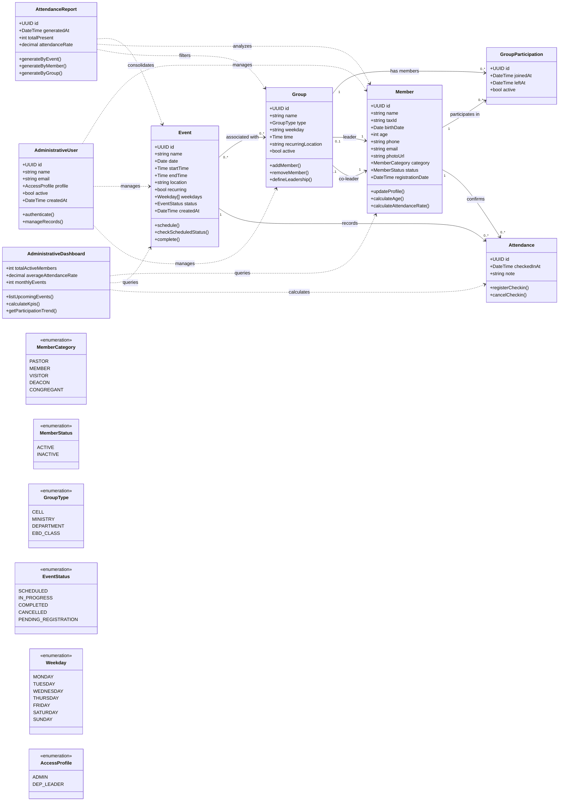

# Class Diagram - Sanctuary Connect

This diagram represents an initial domain model proposal for the Sanctuary Connect MVP, based on the project PRD.



## Modeling Notes

- `Member` centralizes personal data, photo URL, category, status, and attendance history.
- `Member.age` is derived from `Member.birthDate` and stored for filtering/reporting convenience.
- `Group` covers cells, ministries, and departments, including leadership and recurring meeting logistics.
- `Event` represents services, meetings, and social actions, with optional recurrence by weekday.
- `Event` status changes to `IN_PROGRESS` through scheduled time verification, not manual start.
- `Attendance` records member check-ins for events.
- `GroupParticipation` resolves the many-to-many relationship between members and groups, but should be treated as an internal persistence model rather than the main frontend-facing API.
- `AttendanceReport` and `AdministrativeDashboard` represent read-oriented services/views derived from the main data.

## Frontend-facing Group Association API

Member and group association should be managed through the `Member` and `Group` endpoints, not primarily through a standalone `GroupParticipation` CRUD.

### Member payloads

`POST /members` may receive `group_ids` to create the member and associate it with existing groups in the same request.

`PATCH /members/{member_id}` may receive `group_ids` to synchronize the member's active group associations.

If `group_ids` is omitted on update, group associations are not changed.

`GET /members` and `GET /members/{member_id}` return active `group_ids`.

Example:

```json
{
  "name": "Ana Silva",
  "tax_id": "123456789",
  "birth_date": "1995-04-20",
  "phone": "11999999999",
  "email": "ana@email.com",
  "photo_url": "https://example.com/photo.jpg",
  "category": "MEMBER",
  "group_ids": [
    "uuid-do-grupo-1",
    "uuid-do-grupo-2"
  ]
}
```

### Group payloads

`POST /groups` may receive `member_ids` to create the group and associate existing members in the same request.

`PATCH /groups/{group_id}` may receive `member_ids` to synchronize the group's active members.

If `member_ids` is omitted on update, member associations are not changed.

`GET /groups` and `GET /groups/{group_id}` return active `member_ids`.

Example:

```json
{
  "name": "Jovens",
  "type": "MINISTRY",
  "weekday": "SATURDAY",
  "time": "19:30:00",
  "recurring_location": "Sala 2",
  "leader_id": "uuid-do-lider",
  "co_leader_id": "uuid-do-vice-lider",
  "member_ids": [
    "uuid-do-membro-1",
    "uuid-do-membro-2"
  ]
}
```

### Association rules

- `group_ids` and `member_ids` represent the final active association list when present in a `PATCH` request.
- Removed associations should be marked inactive in `GroupParticipation`, preserving historical `joinedAt` and `leftAt`.
- New associations should create active `GroupParticipation` records.
- The API should validate that referenced members and groups exist before committing the operation.
- Dedicated read endpoints may still be exposed for frontend convenience:
  - `GET /members/{member_id}/groups`
  - `GET /groups/{group_id}/members`

## Frontend-facing Attendance API

Attendance should be managed primarily through `Event` and `Member` oriented endpoints.

### Event payloads

`POST /events` may receive `attendance_member_ids` to create the event and register member attendance in the same request.

`PATCH /events/{event_id}` may receive `attendance_member_ids` to synchronize the event's attendance list.

If `attendance_member_ids` is omitted on update, attendance records are not changed.

`GET /events` and `GET /events/{event_id}` return `attendance_member_ids`.

Example:

```json
{
  "name": "Culto de Domingo",
  "date": "2026-07-05",
  "start_time": "19:00:00",
  "end_time": "21:00:00",
  "location": "Templo principal",
  "recurring": true,
  "weekdays": ["SUNDAY"],
  "status": "SCHEDULED",
  "group_ids": ["uuid-do-grupo"],
  "attendance_member_ids": [
    "uuid-do-membro-1",
    "uuid-do-membro-2"
  ]
}
```

### Attendance operations

Use `event_id` and `member_id` for frontend attendance operations instead of requiring the frontend to know the internal `attendance_id`.

- `GET /events/{event_id}/attendances`
- `POST /events/{event_id}/attendances`
- `DELETE /events/{event_id}/attendances/{member_id}`
- `GET /members/{member_id}/events`

`GET /members/{member_id}/events` returns the events where the member has registered attendance.
